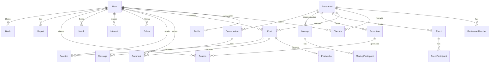

# Documentação do Banco de Dados - Tô no Piramba

## 1. Visão Geral

O banco de dados relacional utiliza **PostgreSQL 16** e é gerenciado pelo **Prisma ORM**. A modelagem foi desenvolvida com foco em:
* **UUIDs** como identificadores primários (`@default(uuid())`).
* **Multi-Tenancy** estrito isolado por `restaurantId` em todas as tabelas sociais e de engajamento.
* **Segurança e Privacidade**: anonimização de localização precisa e blindagem de contatos bloqueados.
* **Integridade Referencial** e índices de alto desempenho para o motor de presença (*"Quem está aqui agora"*).

---

## 2. Diagrama de Entidades Principais



---

## 3. Descrição Detalhada das Tabelas

### 3.1 `User` e `Profile`
* **User**: Credenciais (`email` único, `password` em hash bcrypt), papéis (`Role`: `USER`, `RESTAURANT_ADMIN`, `SUPERADMIN`) e status disciplinar (`UserStatus`: `ACTIVE`, `SUSPENDED`, `BANNED`).
* **Profile**: Informações sociais exibíveis (`name`, `@username` único, `bio`, `avatarUrl`, `coverUrl`, `city`, `tags` de interesses, contagem agregada de check-ins) e flags de privacidade:
  * `invisibleMode` (booleano): oculta a presença do radar público.
  * `showInFlirtRadar` (booleano): habilita/desabilita participação no Mural da Paquera.

### 3.2 `Restaurant` e `RestaurantMember`
* **Restaurant**: Dados da casa (`name`, `slug` único como `pirambeira`, `description`, `address`, `phone`, `openingHours`, `logoUrl`, `coverUrl`, `digitalMenuUrl`, `latitude`, `longitude`, `radiusMeters`).
* **RestaurantMember**: Vínculo administrativo multi-tenant com permissões granulares (`RestaurantRole`: `OWNER`, `MANAGER`, `STAFF`).

### 3.3 `CheckIn` (Motor de Presença)
* Registra a presença física com `userId`, `restaurantId`, `startedAt`, `expiresAt` (padrão de 4 horas), `status` (`ACTIVE`, `EXPIRED`, `CHECKED_OUT`) e coordenadas aproximadas.
* Índices compostos: `@@index([restaurantId, status, expiresAt])` para consultas instantâneas de quem está no estabelecimento em tempo real.

### 3.4 `Post`, `PostMedia`, `Comment` e `Reaction`
* **Post**: Publicação com `type` (`FEED`, `FLIRT`, `SPONSORED`), `caption`, `authorId`, `restaurantId` e contadores cacheados (`likesCount`, `commentsCount`).
* **PostMedia**: Mídias associadas com `url`, `type` (`IMAGE`, `VIDEO`) e ordenação.
* **Comment**: Interações em texto encadeadas com moderação de conteúdo.
* **Reaction**: Curtidas e reações temáticas de boteco (`ReactionType`: `LIKE`, `HEART`, `CHEERS` 🍻, `FIRE` 🔥).

### 3.5 `Interest` e `Match` (Mural da Paquera)
* **Interest**: Demonstração discreta de interesse com `fromUserId`, `toUserId`, `restaurantId`, `status` (`PENDING`, `MATCHED`, `EXPIRED`, `DECLINED`). O interesse é silencioso até haver reciprocidade (*double opt-in*).
* **Match**: Criado atomicamente quando ambos manifestam interesse. Gera automaticamente uma `Conversation` privada entre o par.

### 3.6 `Event` e `EventParticipant`
* **Event**: Programação oficial da casa (Samba, Happy Hour, Transmissões esportivas) com `restaurantId`, datas de início/fim, atrações e limites de capacidade.
* **EventParticipant**: Confirmações de presença dos frequentadores (`GOING`, `INTERESTED`).

### 3.7 `Promotion` e `Coupon`
* **Promotion**: Ofertas ativas configuradas pelo restaurante (descontos, dobro de chopp) com regras de horários e limites de cupons.
* **Coupon**: Código alfanumérico único (`code`, ex: `PIRAMBA-HAPPY-7892`), `userId`, `status` (`CLAIMED`, `USED`, `EXPIRED`) e data de validação pela equipe.

### 3.8 `Meetup` e `MeetupParticipant`
* **Meetup**: Mesas comunitárias e encontros espontâneos criados pelos clientes no próprio bar (`"Tomar uma gelada e falar de tech"`, `"Mesa de solteiros"`, `"Torcida Bahia x Vitória"`).
* **MeetupParticipant**: Clientes confirmados na mesa.

### 3.9 `Conversation` e `Message`
* **Conversation**: Sala de mensagens diretas escopada pelo estabelecimento (`restaurantId`) e tipo (`MATCH`, `MEETUP`, `DIRECT`).
* **Message**: Mensagens de texto com timestamp, status de entrega e leitura.

### 3.10 `Report`, `Block` e `AuditLog`
* **Report**: Central de denúncias de abuso (`ReportTargetType`: `POST`, `COMMENT`, `USER`) com status (`PENDING`, `INVESTIGATING`, `RESOLVED`, `DISMISSED`) e notas de moderação.
* **Block**: Bloqueio bilateral que omite publicações, notas da paquera e conversas entre as partes.
* **AuditLog**: Trilha de auditoria para ações administrativas (exclusão de posts, banimento, validação de cupons).

---

## 4. Índices e Otimizações de Desempenho

```sql
-- Busca rápida de presença ativa por bar
CREATE INDEX idx_checkins_active ON "CheckIn" ("restaurantId", "status", "expiresAt");

-- Feed cronológico filtrado por restaurante
CREATE INDEX idx_posts_feed ON "Post" ("restaurantId", "type", "createdAt" DESC);

-- Busca de interesses pendentes para detecção imediata de Match
CREATE UNIQUE INDEX idx_interest_pair ON "Interest" ("fromUserId", "toUserId", "restaurantId");

-- Validação instantânea de cupons promocionais
CREATE UNIQUE INDEX idx_coupon_code ON "Coupon" ("code");
```

---

## 5. Script de Seed Realista

O arquivo `backend/prisma/seed.ts` popula automaticamente:
1. **Restaurante Pirambeira** completo (Pituba, Salvador - BA), cardápio baiano, carta de drinks e fotos em alta definição.
2. **20 Frequentadores realistas** com avatares, bios autênticas de Salvador e histórico de check-ins.
3. **12 Check-ins ativos** alimentando o radar de presença.
4. **Feed dinâmico** com fotos de chopp, petiscos e encontros.
5. **Notas no Mural da Paquera** e 1 Match ativo demonstrando a integração com o Chat.
6. **Agenda Cultural** com Samba do Piramba e Happy Hour dos Amigos.
7. **Promoções exclusivas** com códigos de cupom prontos para validação.